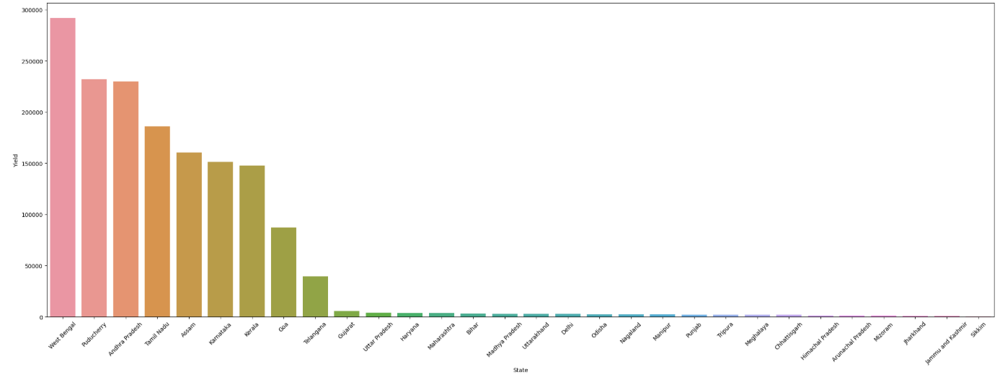
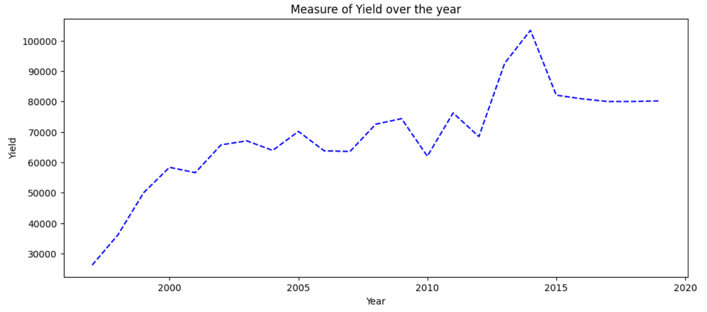
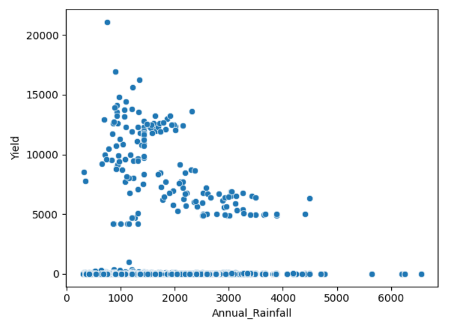
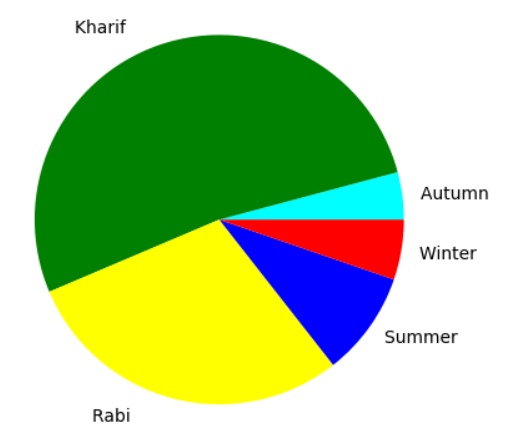

# Indian Crop Yield Analysis

A data analysis and visualization project that explores crop yield trends across India using Python. The project analyzes the relationship between agricultural factors such as rainfall, fertilizer usage, crop seasons, and state-wise production to uncover meaningful insights from crop yield data.

## Project Overview

Agriculture plays a vital role in India's economy. Understanding crop yield patterns can help identify factors that influence agricultural productivity and support data-driven decision-making.

This project performs:

* Data cleaning and preprocessing
* Exploratory Data Analysis (EDA)
* State-wise crop yield analysis
* Seasonal yield distribution analysis
* Trend analysis over time
* Visualization of agricultural data

## Dataset

The dataset contains information related to:

* Crop names
* States
* Crop year
* Annual rainfall
* Fertilizer usage
* Pesticide usage
* Area cultivated
* Production
* Yield

## Technologies Used

* Python
* Jupyter Notebook
* Pandas
* NumPy
* Matplotlib
* Seaborn

## Project Structure

```text
Indian_Crop_Yield_Analysis/
│
├── CropYield.ipynb
├── Crop_Yield.csv
├── yield_by_state.png
├── yield_over_the_years.png
├── seasonal_yield_distribution.png
├── yield_vs_annual_rainfall.png
└── README.md
```

## Visualizations

### Yield by State



### Yield Trend Over the Years



### Yield vs Annual Rainfall



### Seasonal Yield Distribution



## Key Findings

* West Bengal recorded the highest crop yield among the analyzed states.
* Crop yield showed an overall increasing trend over the years.
* Kharif and Rabi seasons contributed the majority of total agricultural yield.
* Significant variations in productivity were observed across different states.
* Agricultural output appears to be influenced by multiple factors beyond rainfall alone.

## How to Run

1. Clone the repository

```bash
git clone https://github.com/Swaroop-Haridas/Indian_Crop_Yield_Analysis.git
```

2. Navigate to the project directory

```bash
cd Indian_Crop_Yield_Analysis
```

3. Install dependencies

```bash
pip install pandas numpy matplotlib seaborn
```

4. Open the notebook

```bash
jupyter notebook CropYield.ipynb
```

## Future Improvements

* Build machine learning models for crop yield prediction.
* Compare regression algorithms for forecasting.
* Develop an interactive dashboard using Streamlit or Power BI.
* Incorporate additional agricultural and weather datasets.
